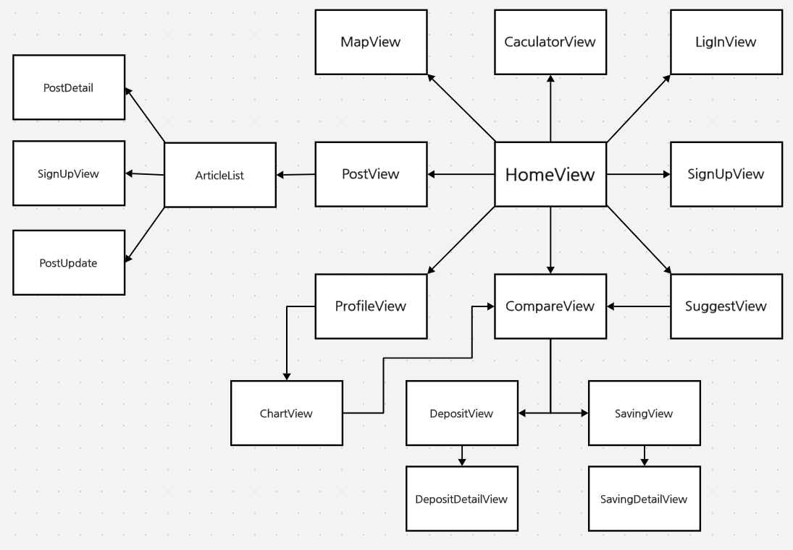
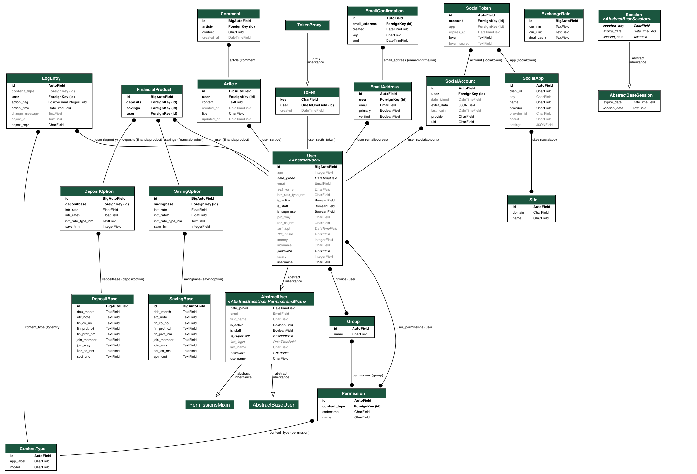

# 금융 상품 비교 애플리케이션

### Notion
https://www.notion.so/FINAL_Project-7e36177430464c5ab9bf6b771ec3cba9?pvs=4

## 팀원 정보 및 업무 분담 내역
  ### 전승혜 (팀장)
    - Vue.js (메인)
    - CSS
    - PPT
    - 업무 분담
    - 일정 조율
  ### 김재훈 (팀원)
    - Django
    - Vue.js (서브)
    - 발표

## 설계 내용(아키텍처 등) 및 실제 구현 정도

## 데이터베이스 모델링 (ERD)

## 금융 상품 추천 알고리즘에 대한 기술적 설명
    - 유저 정보에 선호도 저장 (주거래 은행, 가입 방법, 금리 유형)
      - user 모델에 필드 추가
    - 선호하는 키워드가 모두 포함된 상품 출력 (설정하지 않으면 모든 값 허용)

## 서비스 대표 기능들에 대한 설명

## 기타(느낀 점, 후기 등)
### 전승혜
  - 항상 마무리 짓지 못한 프로젝트들만을 경험하다가 처음으로 완성된 웹 하나를 만들어보는 값진 경험을 했다. 기획은 여러 번 해봤던 기억으로 최대한 빨리 프로젝트를 진행하고자 노력했다. 주말 포함 9일이라는 짧은 기간이었지만 밤도 새워보고 함께 프론트와 백을 나누어 하다보니 협동심도 더 생기게 되었다. 중간에 코딩 실력 미숙으로 인해 프론트 진행이 느려지기도 했지만, 팀원의 도움으로 함수를 함께 짜고 서로 모르는 부분을 보완하며 실력이 향상되었다. 팀원의 백엔드 속도가 빠른것을 보고 추후 백엔드를 하기 위해서는 실력을 더 쌓아야겠다고 생각했다.
### 김재훈
처음으로 프로젝트를 겪어 보면서 기획과 과정이 얼마나 중요한지 깨달았다.
당일 한 일들을 기록하거나, 오류등을 기록하는 것이 협업에서 얼마나 중요한지 몸으로 직접 느꼈다.
또한 백엔드 개발자를 꿈꾸는 사람으로써 DB를 얼마나 잘 만드는지에 따라 프론트 측에서 코드를 작성하는데에 필요한 노력이 얼마나 달라지는지 직접 vue.js 코드를 작성하면서 체감했다.
  
